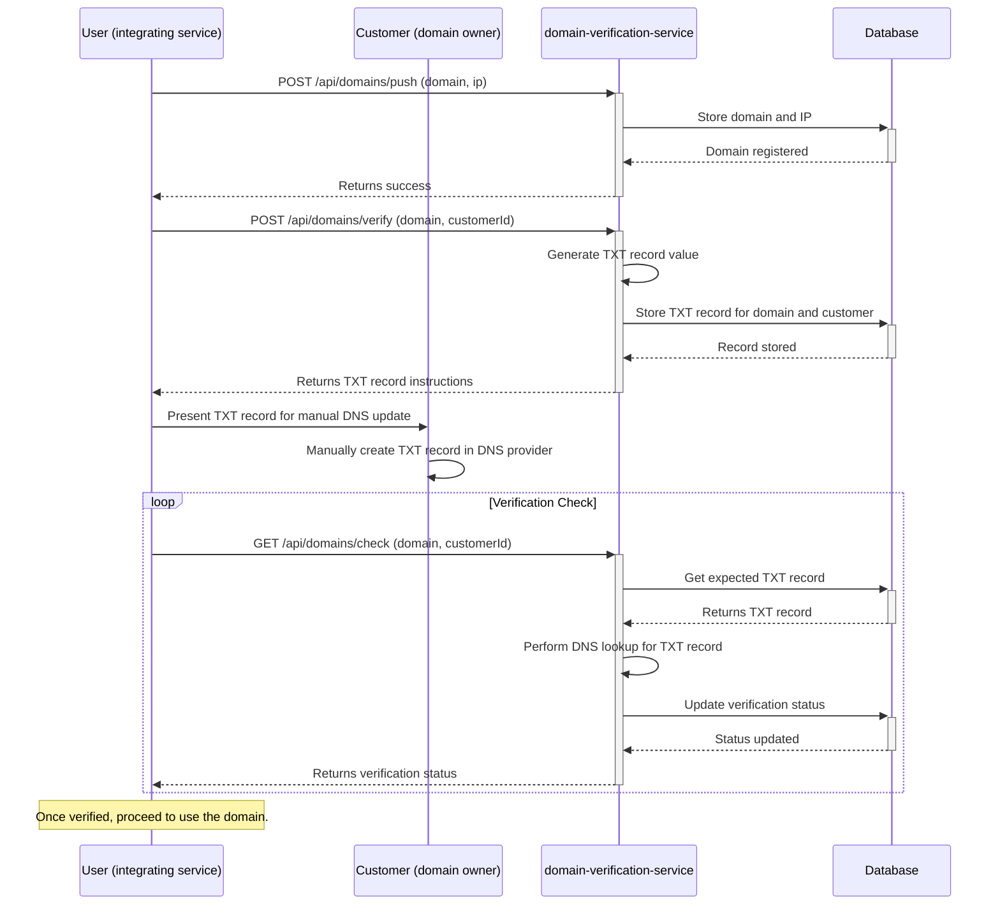

# domain-verification-service <!-- omit in toc -->

Verify and instruct domain configuration, enabling you to proceed pointing to them after DNS TXT record verification.

- [How to use this service](#how-to-use-this-service)
  - [Client SDK](#client-sdk)
    - [Features](#features)
    - [Installation](#installation)
    - [Quick Start](#quick-start)
    - [Environment Support](#environment-support)
- [Flow Diagram](#flow-diagram)
- [API Documentation](#api-documentation)
- [MCP Server (soon)](#mcp-server-soon)
- [Development](#development)
- [Testing](#testing)
  - [Dockerized Testing](#dockerized-testing)
  - [Test Database Management](#test-database-management)
  - [Test Scenarios](#test-scenarios)
- [Database Management](#database-management)
  - [Database Migration Lifecycle](#database-migration-lifecycle)
    - [Production Environment](#production-environment)
    - [Development Environment](#development-environment)
- [Deployment](#deployment)

## How to use this service

This service is designed for a "User" (e.g., a service or backend) that manages domains on behalf of its "Customers" (the end-users who own the domains).

1.  **User:** Register a customer's domain by sending a `POST` request to `/api/domains/push` with the domain name and IP address.
2.  **User:** Request domain verification for a customer by sending a `POST` request to `/api/domains/verify` with the domain name and the customer's ID. The service returns a unique TXT record.
3.  **User & Customer:** The User presents the TXT record instructions to the Customer. The Customer must then manually add this TXT record to their domain's DNS settings.
4.  **User:** Periodically check if the domain is verified by sending a `GET` request to `/api/domains/check` with the domain name and customer ID.
5.  **User:** Once verified, the User can proceed to change its infrastructure/application/service to use the verified domain for the customer.

### Client SDK

A TypeScript client library for the Domain Verification Service API, providing type-safe domain verification and validation with built-in input validation using Zod.

#### Features

- 🔒 **Type Safety**: Full TypeScript support with comprehensive type definitions
- ✅ **Input Validation**: Built-in validation using Zod schemas
- 🚀 **Promise-based**: Modern async/await API
- 📦 **Zero Configuration**: Works out of the box with sensible defaults
- 🌐 **Node.js Compatible**: Uses node-fetch for HTTP requests

#### Installation

```bash
pnpm add @url4irl/domain-verification
# or
npm install @url4irl/domain-verification
# or
yarn add @url4irl/domain-verification
```

#### Quick Start

```typescript
import { DomainVerificationClient } from '@url4irl/domain-verification';

const client = new DomainVerificationClient(); // or specify a custom base URL in case you are self-hosting the service

// Register a domain
await client.registerDomain({
  domain: 'example.com',
  ip: '192.168.1.1',
  customerId: 'customer123'
});

// Generate verification token
const tokenResponse = await client.generateVerificationToken({
  domain: 'example.com',
  customerId: 'customer123',
  serviceHost: 'verification.yourservice.com',
  txtRecordVerifyKey: 'your-verify-key'
});

// Check domain verification
const verificationResult = await client.checkDomainVerification({
  domain: 'example.com',
  customerId: 'customer123',
  serviceHost: 'verification.yourservice.com',
  txtRecordVerifyKey: 'your-verify-key'
});
```

#### Environment Support

- **Node.js**: 14+ (uses node-fetch for HTTP requests)
- **TypeScript**: 4.0+
- **ES Modules**: Supported
- **CommonJS**: Supported

## Flow Diagram



## API Documentation

The API documentation is available on `/docs`. You can access it by navigating to `https://domain-verification.url4irl.com/docs` in your web browser (or `http://localhost:4000/docs` if running locally).

OpenAPI specs are also available at [openapi.json](./openapi.json).

## MCP Server (soon)

This service provides a MCP (Model Context Protocol) server that allows you to interact with the service using the MCP protocol. The MCP server is available at `/mcp`.

## Development

To run the service in development mode, follow these steps:
1. Clone the repository.
2. Make sure you have Node.js, pnpm and Docker (with Docker Compose) installed on your machine.
3. Install the dependencies:
    ```bash
    pnpm install
    ```
4. Start the service:
    ```bash
    pnpm dev
    ```
5. The service will be available at `http://localhost:4000`
6. See the [Database Management](#database-management) to learn how to manage the database.

## Testing

This project includes comprehensive end-to-end (e2e) tests using Jest and Supertest.

Tests run against a separate test database (`postgres_test`) to avoid affecting your development data.

```bash
# Setup test environment (run once)
pnpm run test:setup

# Run tests with coverage report
pnpm run test:coverage

# Cleanup test environment
pnpm run test:teardown

# Setups the test environment, runs all tests, and cleans up afterwards
pnpm test
```

### Dockerized Testing

Before deploying the service, it's best practice to run the tests against a production-like Docker container. The project includes a script to facilitate this.

```bash
pnpm docker:test
```

This script will:
1.  Build the Docker image.
2.  Start the containerized service and a test database.
3.  Run the e2e tests against the service running in Docker.
4.  Stop and remove the containers.

### Test Database Management

Each test automatically:
1. Sets up the test database schema before running
2. Cleans all data before each test
3. Resets auto-increment sequences
4. Closes database connections after completion

### Test Scenarios

- ✅ Successful operations
- ✅ Validation errors (missing fields)
- ✅ Database interactions
- ✅ Integration flows
- ✅ Edge cases and error conditions
- ✅ Concurrent operations
- ✅ Data cleanup and isolation

## Database Management

### Database Migration Lifecycle

#### Production Environment

Database migrations are managed using Drizzle ORM. In a production environment, migrations must be applied **manually** by accessing the running container and executing the following command within it:

```bash
pnpm drizzle migrate --config ./dist/drizzle.config.js
```

This command will apply any pending schema changes to the database. Ensure you run this command after any deployment that includes database schema modifications.

#### Development Environment

In development, create and apply migrations using:

```bash
pnpm run db:generate # Generates a new migration file
pnpm run db:migrate # Applies the migration to the database
```

## Deployment

This project is deployed to a Coolify instance. When code changes are pushed to the repository, Coolify automatically rebuilds the project using the `Dockerfile` and deploys the updated service.


Contributions are always welcome ❤️

