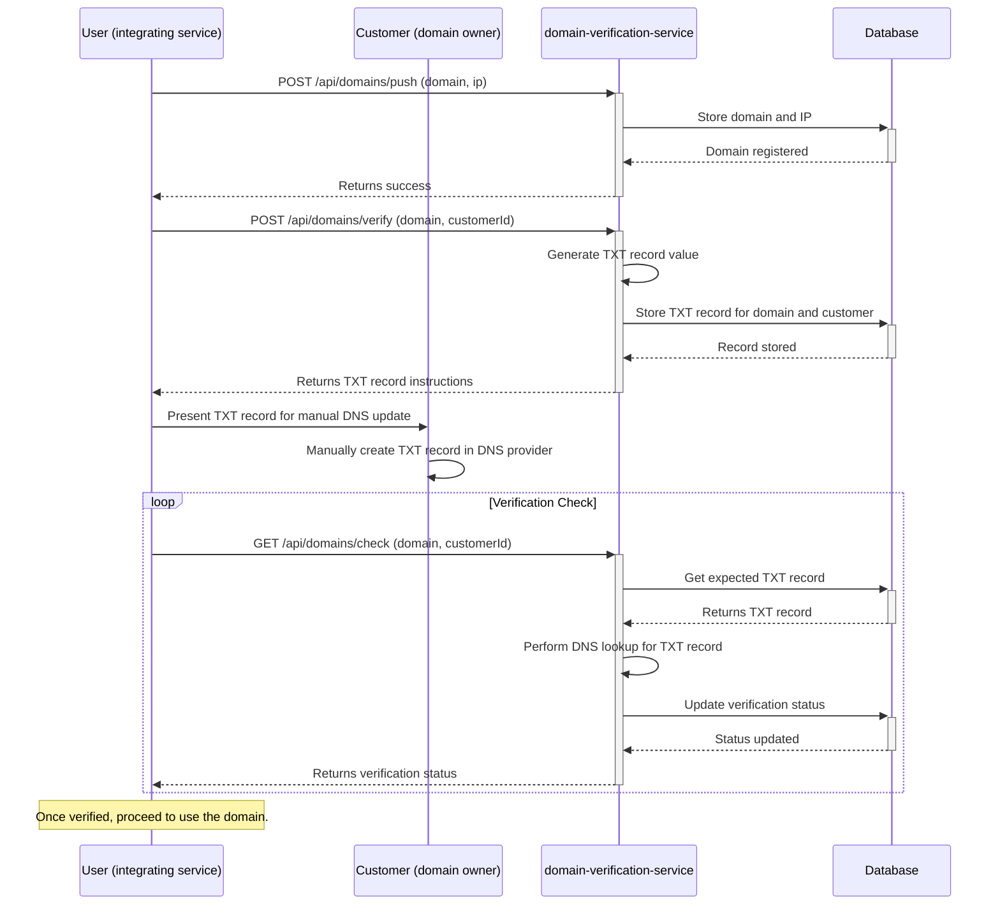

# domain-verification-service <!-- omit in toc -->

Verify and instruct domain configuration, enabling you to proceed pointing to them after DNS TXT record verification.

- [How to use this service](#how-to-use-this-service)
- [Flow Diagram](#flow-diagram)
- [API Documentation](#api-documentation)
- [MCP Server (work in progress)](#mcp-server-work-in-progress)
- [Development](#development)
- [Testing](#testing)
  - [Test Database Management](#test-database-management)
  - [Test Scenarios](#test-scenarios)
- [Deployment](#deployment)

## How to use this service

This service is designed for a "User" (e.g., a service or backend) that manages domains on behalf of its "Customers" (the end-users who own the domains).

1.  **User:** Register a customer's domain by sending a `POST` request to `/api/domains/push` with the domain name and IP address.
2.  **User:** Request domain verification for a customer by sending a `POST` request to `/api/domains/verify` with the domain name and the customer's ID. The service returns a unique TXT record.
3.  **User & Customer:** The User presents the TXT record instructions to the Customer. The Customer must then manually add this TXT record to their domain's DNS settings.
4.  **User:** Periodically check if the domain is verified by sending a `GET` request to `/api/domains/check` with the domain name and customer ID.
5.  **User:** Once verified, the User can proceed to change its infrastructure/application/service to use the verified domain for the customer.

## Flow Diagram



## API Documentation

The API documentation is available on `/docs`. You can access it by navigating to `http://localhost:4000/docs` in your web browser.

OpenAPI specs are also available at [openapi.json](./openapi.json).

## MCP Server (work in progress)

This service provides a MCP (Model Context Protocol) server that allows you to interact with the service using the MCP protocol. The MCP server is available at `/mcp`.

## Development

To run the service in development mode, follow these steps:
1. Clone the repository.
2. Make sure you have Node.js, pnpm and Docker (with Docker Compose) installed on your machine.
3. Install the dependencies:
    ```bash
    pnpm install
    ```
4. Start the service:
    ```bash
    pnpm dev
    ```

## Testing

This project includes comprehensive end-to-end (e2e) tests using Jest and Supertest.

Tests run against a separate test database (`postgres_test`) to avoid affecting your development data.

```bash
# Setup test environment (run once)
pnpm run test:setup

# Run tests with coverage report
pnpm run test:coverage

# Cleanup test environment
pnpm run test:teardown

# Setups the test environment, runs all tests, and cleans up afterwards
pnpm test
```

### Test Database Management

Each test automatically:
1. Sets up the test database schema before running
2. Cleans all data before each test
3. Resets auto-increment sequences
4. Closes database connections after completion

### Test Scenarios

- ✅ Successful operations
- ✅ Validation errors (missing fields)
- ✅ Database interactions
- ✅ Integration flows
- ✅ Edge cases and error conditions
- ✅ Concurrent operations
- ✅ Data cleanup and isolation

## Deployment

This project is deployed to a Coolify instance. When code changes are pushed to the repository, Coolify automatically rebuilds the project using the `Dockerfile` and deploys the updated service.


Contributions are always welcome ❤️

